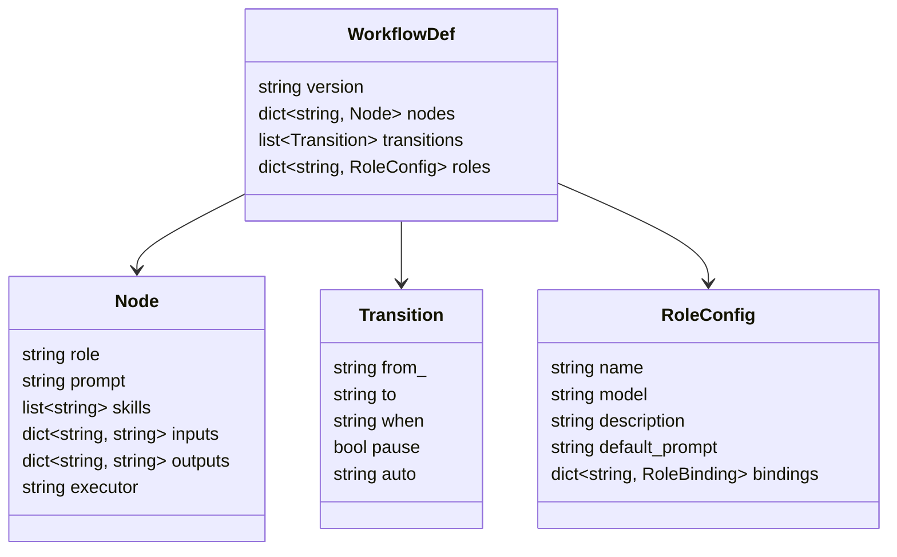
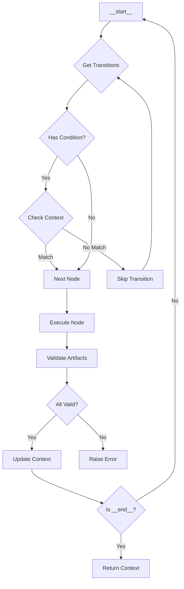
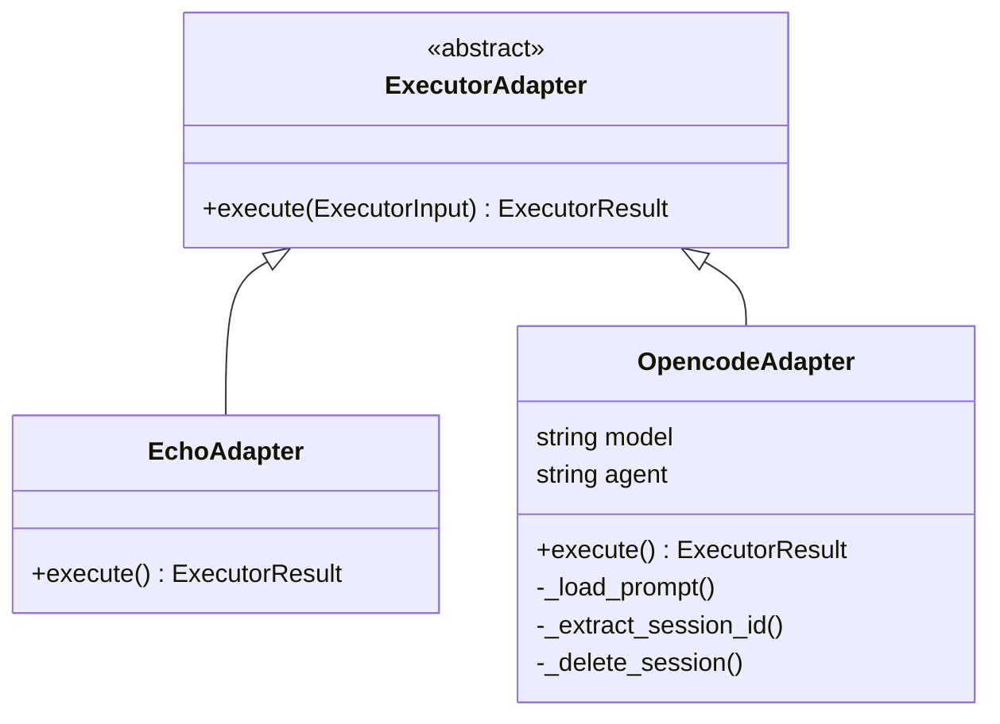
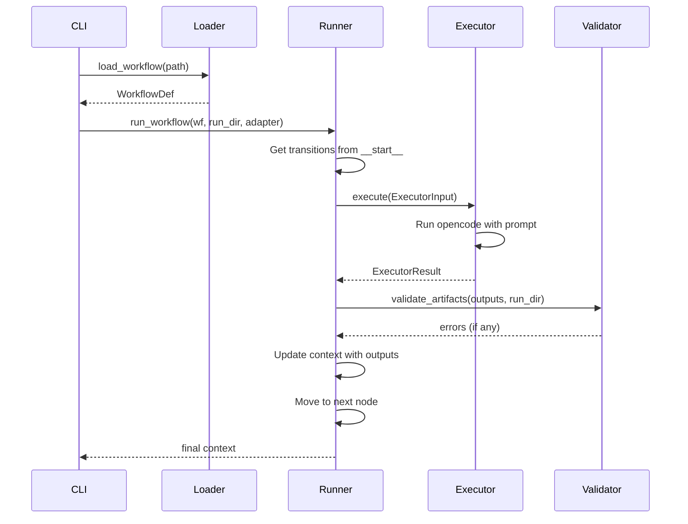
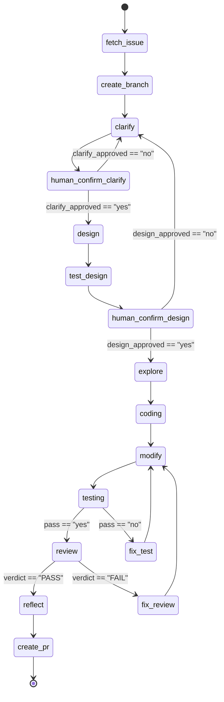

# Flowctl Architecture

## Overview

Flowctl is a node-graph workflow engine that orchestrates AI agents to transform software specifications into code changes. It executes workflows defined in YAML, routing data between nodes and managing artifact validation.

## Core Components

### 1. Workflow Definition (`models.py`)



**Key Concepts:**
- **Node**: A single execution step with role, prompt, inputs/outputs
- **Transition**: Edge connecting nodes, optionally with conditional guards (`when`)
- **Role**: Configuration for AI agent (model, prompt templates)

### 2. Workflow Loader (`loader.py`)

- Parses YAML workflow files
- Validates graph structure (start/end transitions, node references)
- Returns `WorkflowDef` Pydantic model

### 3. Workflow Runner (`runner.py`)



**Execution Flow:**
1. Start at `__start__` pseudo-node
2. Find matching transitions (evaluate `when` conditions against context)
3. Execute node via executor adapter
4. Validate output artifacts exist
5. Update context with outputs
6. Move to next node
7. Repeat until `__end__`

**V1 Limitations:**
- Only first matching transition used (no branch fan-out)
- Max 100 iterations (cycle detection)

### 4. Executor System (`executors/`)



**ExecutorInput:**
- `role`: Agent role name
- `prompt_path`: Path to prompt file
- `skill_paths`: Skill files to load
- `inputs`: Input artifact paths (read from)
- `outputs`: Output artifact paths (write to)
- `run_dir`: Working directory for execution
- `workflow_dir`: Root workflow directory (for resolving prompts/skills)

**ExecutorResult:**
- `outputs`: Dict of output values
- `returncode`: Process exit code
- `stdout/stderr`: Process output

**EchoAdapter:**
- Mock executor for testing/dry-run
- Creates placeholder artifacts

**OpencodeAdapter:**
- Real execution via `opencode` CLI
- Runs with `--format json` for structured output
- Session cleanup: extracts `sessionID` from JSON output, deletes after execution
- Uses absolute paths for `--dir` and `cwd` to avoid path resolution issues

### 5. CLI (`cli.py`)

Commands:
- `flowctl init`: Bootstrap `.flows/` directory
- `flowctl upgrade`: Reconcile config for framework updates
- `flowctl run`: Execute workflow
  - `--dry-run`: Mock execution
  - `--executor`: echo/opencode
  - `--model`: Model override
  - `--agent`: Agent name
  - `--issue`: GitHub issue URL (adds to context)

### 6. Artifact Validator (`artifact_validator.py`)

Validates that output artifacts exist after node execution. Checks file paths declared in `outputs`.

## Directory Structure

```
.flows/
├── config.yaml           # Framework config (executor preference, version)
├── workflows/
│   ├── spec-to-code.yaml # Full spec-to-code pipeline (16 nodes)
│   ├── hello-world.yaml  # Test workflow
│   └── *.yaml            # Other workflows
├── prompts/
│   ├── fetch-issue.md
│   ├── create-branch-issue.md
│   ├── *.md              # Node prompts
├── roles/
│   ├── fetcher.yaml
│   ├── developer.yaml
│   ├── tester.yaml
│   ├── *.yaml            # Role configs
└── runs/
    ├── latest/           # Latest execution artifacts
    └── <run-id>/         # Named execution artifacts

src/flowctl/
├── cli.py                # Click CLI commands
├── loader.py             # YAML loader/validator
├── models.py             # Pydantic models
├── runner.py             # Workflow execution engine
├── artifact_validator.py # Output validation
├── init_cmd.py           # `init` command
├── upgrade_cmd.py        # `upgrade` command
├── executors/
│   ├── base.py           # ExecutorInput/ExecutorResult
│   ├── echo.py           # Mock executor
│   └ opencode.py         # Opencode CLI executor

tests/
├── test_cli.py
├── test_loader.py
├── test_runner.py
├── test_executors.py
└── test_*.py             # Unit tests
```

## Data Flow



## Workflow Execution Example (spec-to-code)



## Key Design Decisions

1. **YAML-based workflow definition**: Declarative, versionable, human-readable
2. **Pydantic models**: Type-safe parsing with validation
3. **Executor abstraction**: Supports mock (echo) and real (opencode) execution
4. **Artifact-based data flow**: Files as inputs/outputs, not in-memory data
5. **Conditional transitions**: `when` guards enable branching logic
6. **Session cleanup**: Opencode executor deletes sessions after each node to prevent accumulation
7. **Absolute paths**: Required for subprocess cwd to avoid path resolution failures

## Dependencies

- **click**: CLI framework
- **pyyaml**: YAML parsing
- **pydantic**: Data validation/models
- **pytest**: Testing (dev)

## Current Limitations

1. Single transition per step (no parallel branches)
2. No retry logic on node failure
3. No pause/resume for long-running workflows
4. No workflow composition (calling other workflows)
5. File-based artifacts only (no database/API integration)