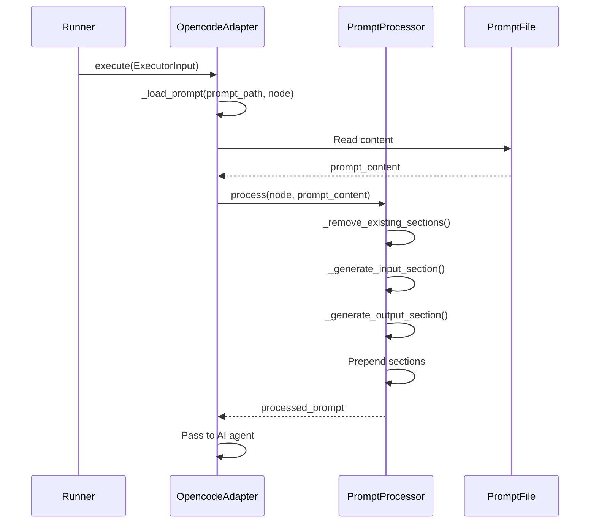

# Node Input/Output Injection Design

## Problem

Currently, node inputs and outputs are hardcoded in prompt files, creating duplication with the workflow YAML definitions. This leads to:
- Manual synchronization burden
- Risk of inconsistencies between workflow definitions and prompt descriptions
- Maintenance overhead when adding or modifying nodes

Example of current duplication:

**Workflow YAML:**
```yaml
nodes:
  clarify:
    inputs: {requirement: requirement.md}
    outputs: {clarify_md: clarify.md}
```

**Prompt file (clarity.md):**
```markdown
## Input

Read the requirement from `requirement.md` in the run directory.

## Output

Write clarified requirements to `clarify.md`.
```

## Solution

Create a `PromptProcessor` component that dynamically assembles input/output sections from node definitions and injects them into prompts at execution time.

**Key principles:**
- Single source of truth: node definitions in workflow YAML
- Automatic injection: prompts don't need to mention inputs/outputs
- Clean separation: task description in prompts, data flow from definitions

## Architecture

### New Component: PromptProcessor

Location: `src/flowctl/prompt_processor.py`

```
PromptProcessor
├── process(node: Node, prompt_content: str) -> str
├── _remove_existing_sections(content: str) -> str
├── _generate_input_section(inputs: dict[str, str]) -> str
├── _generate_output_section(outputs: dict[str, str]) -> str
└── _should_process(node: Node) -> bool
```

**Methods:**

1. `process(node, prompt_content)` - Main entry point
   - Check if node should be processed (skip bash executor)
   - Remove existing Input/Output sections from prompt
   - Generate new input section from node.inputs
   - Generate new output section from node.outputs
   - Prepend sections to prompt
   - Return transformed prompt

2. `_remove_existing_sections(content)` - Strip manual sections
   - Remove any `## Input` or `## Output` sections
   - Uses regex to match from section header to next `##` or end of file
   - Case-insensitive matching (`## input`, `## Input`, `## INPUT`)
   - Preserves other sections like `## Task`, `## Notes`

3. `_generate_input_section(inputs)` - Create input section
   - Returns empty string if inputs dict is empty
   - Format:
     ```markdown
     ## Input
     
     - {key}: Read from {filename}
     ```
   - Example:
     ```markdown
     ## Input
     
     - requirement: Read from requirement.md
     - architecture: Read from ARCHITECTURE.md
     ```

4. `_generate_output_section(outputs)` - Create output section
   - Returns empty string if outputs dict is empty
   - Format:
     ```markdown
     ## Output
     
     - {key}: Write to {filename}
     ```
   - Example:
     ```markdown
     ## Output
     
     - design_md: Write to docs/design.md
     ```

5. `_should_process(node)` - Determine if processing needed
   - Return `False` if `node.executor == 'bash'`
   - Return `True` otherwise

### Integration Point

Modified: `src/flowctl/executors/opencode.py`

**Changes to OpencodeAdapter:**

1. Import PromptProcessor at module level
2. Initialize processor in `__init__`: `self.processor = PromptProcessor()`
3. Modify `_load_prompt()` method:
   ```python
   def _load_prompt(self, prompt_path: str, node: Node) -> str:
       # Read prompt file (existing logic)
       prompt_content = read_file(prompt_path)
       
       # Process prompt with dynamic input/output injection
       processed_prompt = self.processor.process(node, prompt_content)
       
       return processed_prompt
   ```

### Data Flow



## Implementation Details

### Markdown Format

Generated sections use standard Markdown format matching existing prompt style:

**Input section:**
```markdown
## Input

- requirement: Read from requirement.md
- architecture: Read from ARCHITECTURE.md
```

**Output section:**
```markdown
## Output

- design_md: Write to docs/design.md
- test_design_md: Write to docs/test-design.md
```

**Complete prompt example (before processing):**
```markdown
# Design Phase

You are the architect role. Create a technical design based on the clarified requirements.

## Input

Read `clarify.md` to understand the refined requirements.
Read `ARCHITECTURE.md` to understand the current system architecture.

## Task

1. Analyze the requirements and existing codebase structure
2. Design the technical solution
```

**After processing:**
```markdown
## Input

- clarify: Read from clarify.md
- architecture: Read from ARCHITECTURE.md

## Output

- design_md: Write to docs/design.md

# Design Phase

You are the architect role. Create a technical design based on the clarified requirements.

## Task

1. Analyze the requirements and existing codebase structure
2. Design the technical solution
```

### Section Removal Regex

Pattern for removing existing Input sections:
```python
input_pattern = r'^## [Ii]nput.*?(?=^## |\Z)'
```

Pattern for removing existing Output sections:
```python
output_pattern = r'^## [Oo]utput.*?(?=^## |\Z)'
```

Uses `re.MULTILINE` flag for line-by-line matching.

### Edge Cases

1. **Empty inputs/outputs:**
   - Skip section entirely (no header)
   - No error thrown

2. **No existing sections:**
   - Removal returns original prompt unchanged

3. **Only Input/Output sections exist:**
   - After removal, prompt is empty or contains only other content

4. **Nested subsections:**
   - Remove entire top-level Input/Output sections including subsections
   - Stop at next top-level `##` header

5. **Case variations:**
   - Match `## Input`, `## input`, `## INPUT` case-insensitively

6. **Bash executor nodes:**
   - Skip processing entirely
   - Prompt passed unchanged

### Error Handling

**Graceful degradation:**
- Processor never crashes - always returns a string
- If section removal fails, log warning and proceed with original prompt
- If generation fails, log warning and proceed without injected sections

**Logging:**
- Use Python logging module
- Log level: WARNING for failures
- Include node name in log messages for debugging

**No new exceptions:**
- Processor catches its own errors and returns gracefully
- Existing executor error handling unchanged

## Testing Strategy

### Unit Tests

Location: `tests/test_prompt_processor.py`

Test cases:
1. Basic processing with inputs and outputs
2. Processing with only inputs (no outputs)
3. Processing with only outputs (no inputs)
4. Processing with empty inputs and outputs
5. Bash executor node skipped
6. Existing Input section removed
7. Existing Output section removed
8. Case-insensitive section matching
9. Multiple existing sections removed
10. No existing sections (unchanged prompt)
11. Prompt with other sections preserved
12. Error handling (regex failure, generation failure)

### Integration Tests

Update existing executor tests:
- Test prompt processing in OpencodeAdapter
- Verify injected sections appear in prompt
- Test backward compatibility with existing prompts

### Example Test

```python
def test_process_with_inputs_and_outputs():
    processor = PromptProcessor()
    node = Node(
        role="developer",
        prompt="prompts/test.md",
        inputs={"requirement": "requirement.md", "design": "docs/design.md"},
        outputs={"implementation": "implementation.md"}
    )
    prompt = "# Test\n\n## Task\n\nDo something."
    
    result = processor.process(node, prompt)
    
    assert "## Input" in result
    assert "requirement: Read from requirement.md" in result
    assert "design: Read from docs/design.md" in result
    assert "## Output" in result
    assert "implementation: Write to implementation.md" in result
    assert "# Test" in result
    assert "## Task" in result
```

## Benefits

1. **Single source of truth:**
   - Node definitions in workflow YAML define data flow
   - No duplication in prompts
   - Changes propagate automatically

2. **Easier maintenance:**
   - Add/modify nodes without updating prompts
   - No manual synchronization
   - Reduced risk of inconsistencies

3. **Cleaner prompts:**
   - Prompts focus on task instructions
   - Data flow documentation is automatic
   - Consistent format across all prompts

4. **Backward compatible:**
   - Existing prompts work without modification
   - Manual sections are replaced, not duplicated
   - Gradual adoption possible

## Files Changed

### New Files
- `src/flowctl/prompt_processor.py` - PromptProcessor implementation
- `tests/test_prompt_processor.py` - Unit tests

### Modified Files
- `src/flowctl/executors/opencode.py` - Integration with PromptProcessor

### Optional Cleanup
- Remove manual Input/Output sections from existing prompt files in `.flows/prompts/`
- Not required for implementation, but improves consistency

## Scope

This design addresses only the input/output injection feature. Related future enhancements (not in scope):
- Caching for processed prompts
- Template syntax for custom formatting
- Additional metadata in injected sections
- Integration with other executors (bash, echo)

## Success Criteria

1. All unit tests pass
2. Existing integration tests pass
3. PromptProcessor correctly injects sections for sample workflow
4. Bash executor nodes skip processing
5. Backward compatibility maintained
6. No new dependencies added